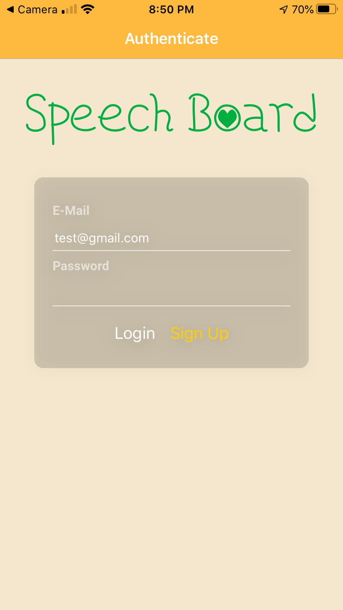
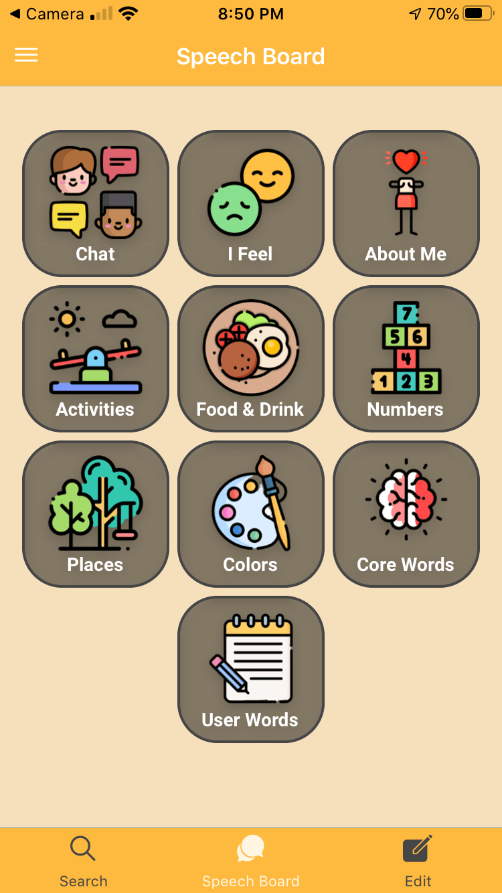
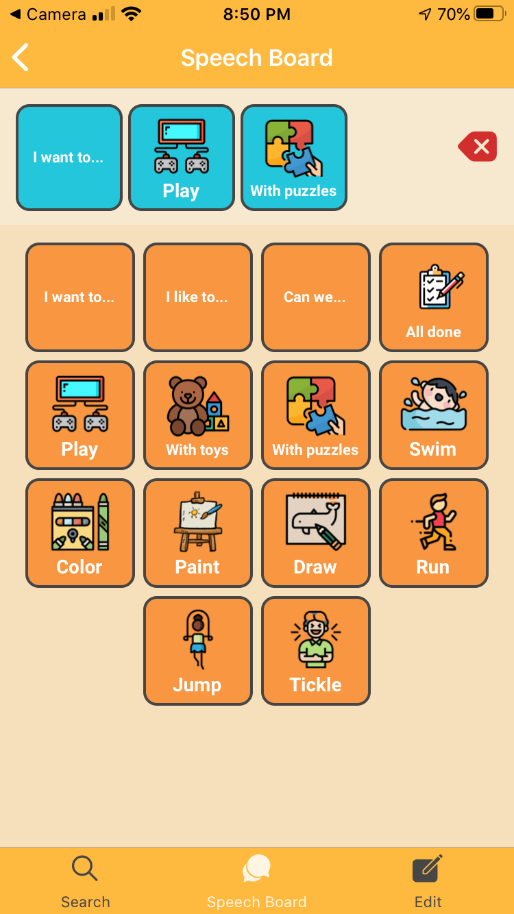
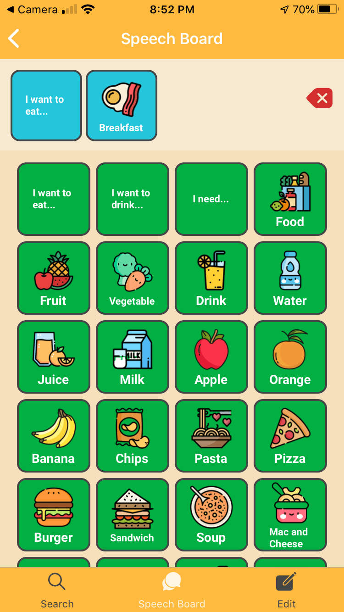
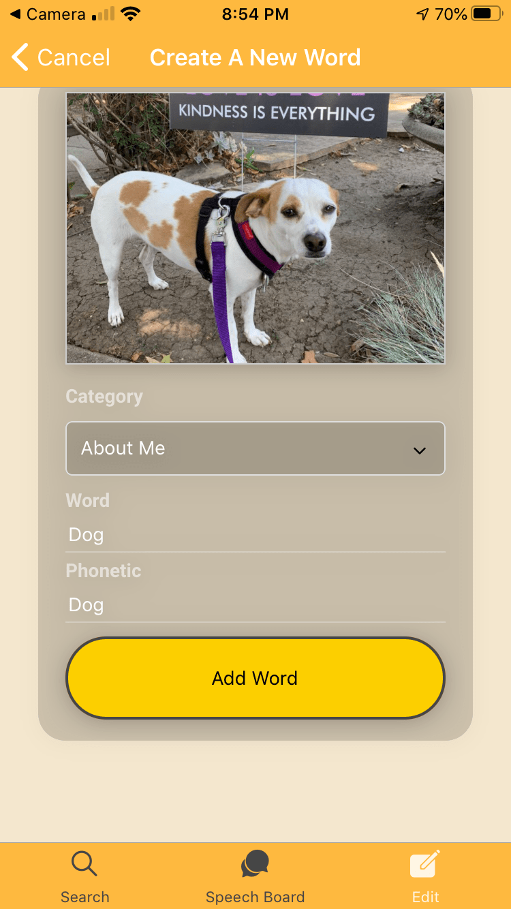
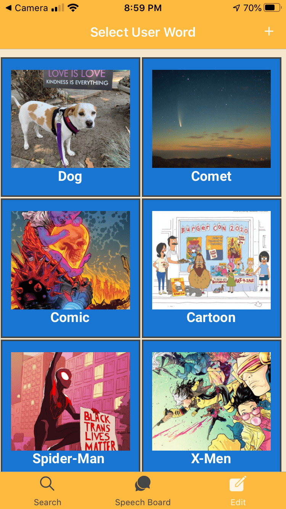
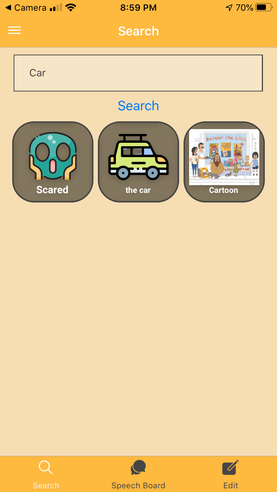
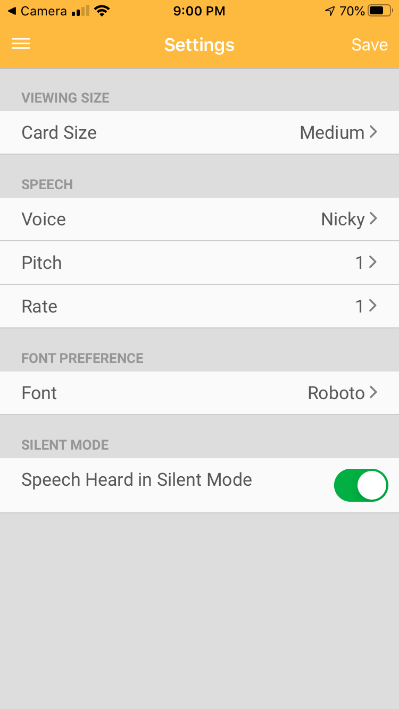

### Speech Board

## Overview
Speech Board is an easy to use communication app for people who cannot speak or need help being understood. It features multiple different voices with customizable options. The user can use anything from single words to creating whole sentences. The core words are organized to make them easy to find and access. The user is able to quickly create new customizable words. They can choose from images from their photo gallery or take pictures with their camera. All newly created words are stored in Google's Firebase database for access on any device. This is an iOS (soon to include Android) React Native app that uses the Expo platform.

## Usage
* Download the "Expo Client" app from the Play Store or App Store.
* Clone this repo to your local computer, `git clone https://github.com/saronnhong/dani-2.0.git`
* Install packages, `npm install`
* Open the project, `npm start`
* Point your phone's camera at the QR code in the terminal to launch the App on your phone.
* Test account: User: test@gmail.com / Password: Test123

## Technologies
DANI uses the following technologies
* React Native
* Expo
* Redux
* Firebase for Authentication and Database

## Examples

User Login/SignUp Authentication with Google's Firebase

Core words organized for easy access

The user can use anything from single words to creating whole sentences.

User can customize their own words or import images from photo gallery or pictures from camera.

Search for specific words

Customizable settings. Choose between different voices, pitch, and speech rate.

